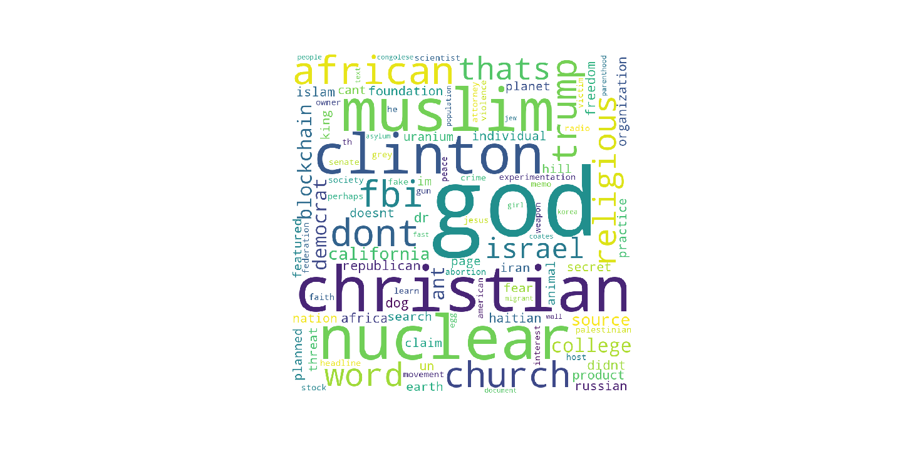
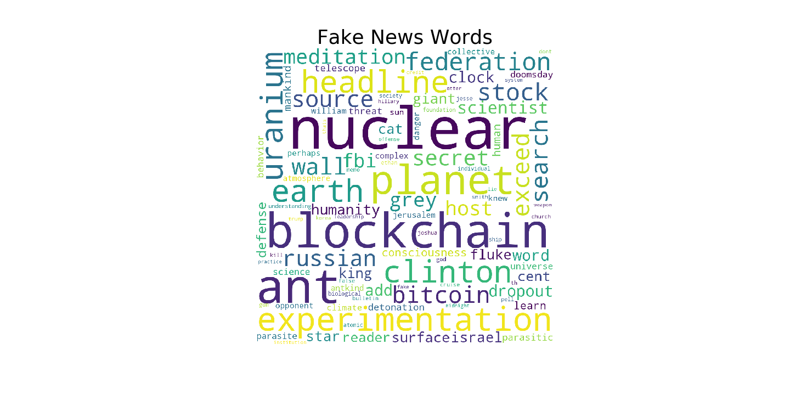
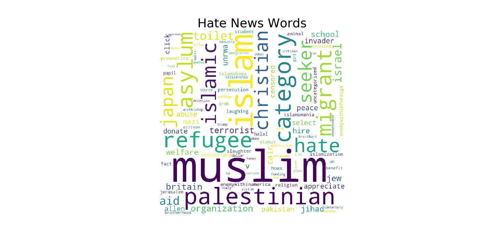
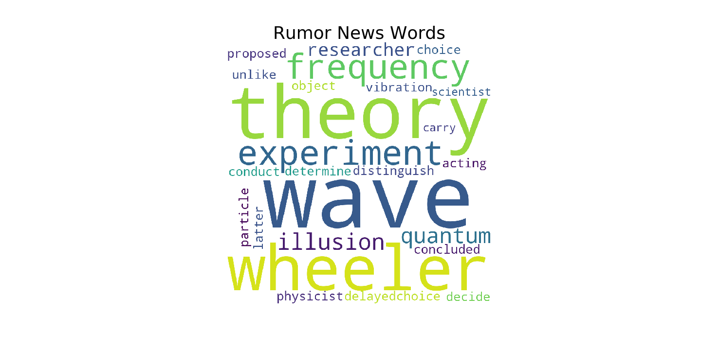
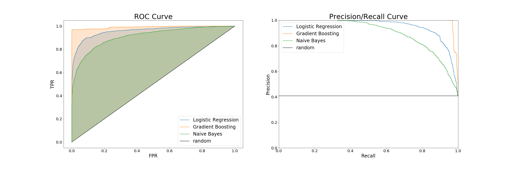
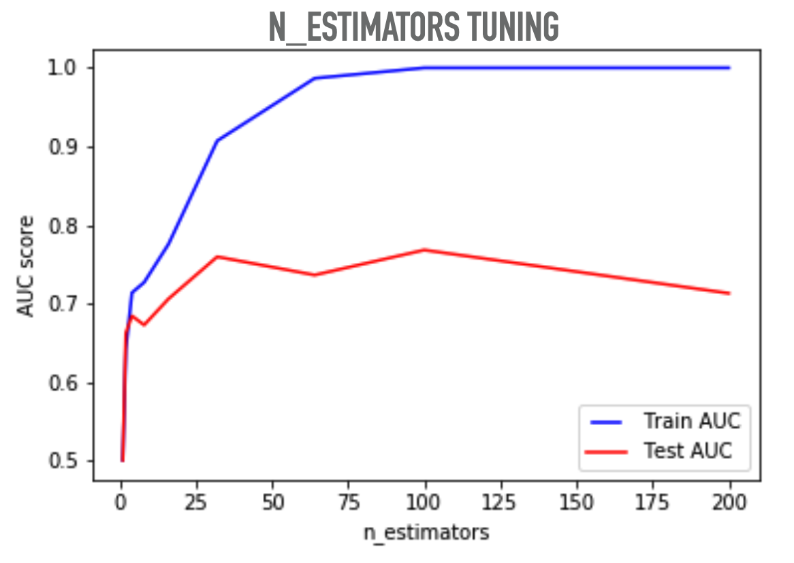
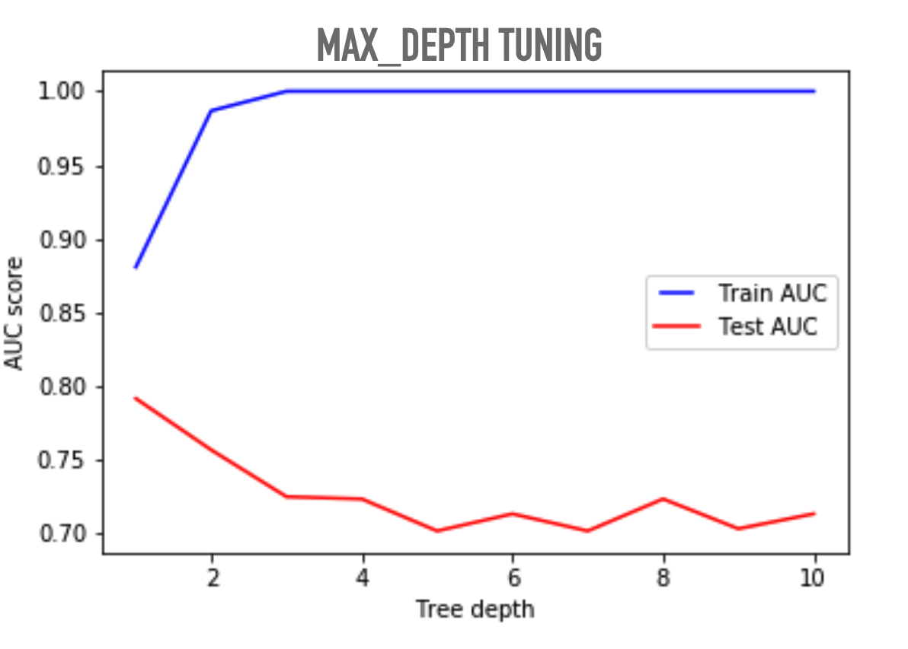
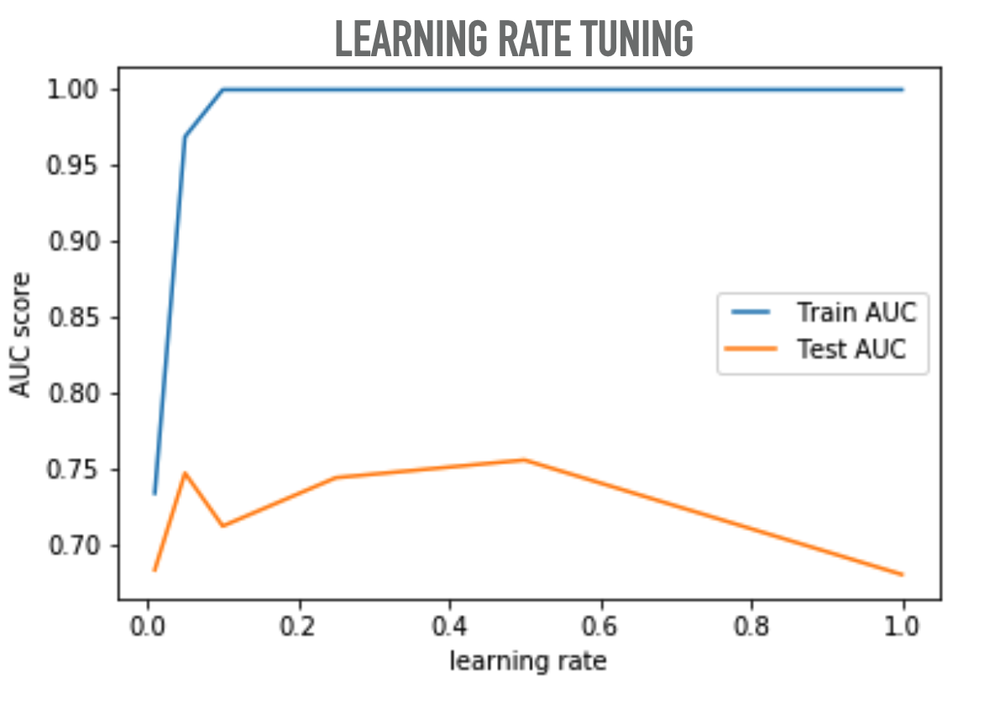

# Fake-News-Detector

Today we are living in the Era of information explosion. Along with the development of the Internet, the emergence and widespread adoption of the social media concept have changed the way news is formed and published. 

News has become faster, less costly and easily accessible with social media. This change has come along with some disadvantages as well. In particular, beguiling content, such as fake news made by social media users, is becoming increasingly dangerous. The fake news problem, despite being introduced for the first time very recently, has become an important research topic due to the high content of social media. Writing fake comments and news on social media is easy for users. The main challenge is to determine the difference between real and fake news. 

## Scope
The focus of this work is using classic machine learning algorithms to build natural language processing classifer. 

## Data

The [Fake News Corpus](https://github.com/several27/FakeNewsCorpus) is an open source dataset composed of millions of news articles mostly scraped from a curated list of 1001 domains from http://www.opensources.co/. 

The corpus was created by scraping (using scrapy) all the domains as provided by http://www.opensources.co/. Then all the pure HTML content was processed to extract the article text with some additional fields (listed below) using the newspaper library. Each article has been attributed the same label as the label associated with its domain.

Click [here](data/sample.csv) for a small representative shard of example data.

Stopwords used for text preprocess is downloaded from the useful repo [news-stopwords](https://github.com/vikasing/news-stopwords.git). Only [1000 stopwords for news](data/sw1k.csv) were used for this project.

## EDA
The news are labeled into 8 types. For each type, the 10 most frequent words are:

**Type**|**Words**
----|-----
rumor|wave, theory, wheeler, illusion, experiment, frequency, quantum, researcher, delayedchoice, physicist
hate|muslim, islam, palestinian, refugee, migrant, islamic, hate, christian, seeker, japan
unreliable|african, haitian, college, africa, dr, hill, un, dog, church, congolese
conspiracy|clinton, iran, fluoride, spring, religious, pp, natural, planned, mineral, parenthood
clickbait|trump, democrat, republican, fbi, featured, california, senate, crime, clinton, attorney
satire|christian, contact, im, grey, dont, jake, movie, thats, barista, he
fake|nuclear, blockchain, planet, experimentation, earth, headline, federation, stock, search, bitcoin
reliable|christian, church, religious, god, abortion, speech, faith, page, weapon, faction
bias|rose, abortion, planned, museum, prolife, democrat, protection, infanticide, voting, promising
political|god, word, wonder, grace, jesus, claim, human, presence, theological, eclipse
junksci|lazar, shapr, networking, ufo, base, individual, topic, facility, clearance

Word clouds are generated for different word sets.

Also, the following word clouds shows a few example of the most frequent words from different types of news.

A tendency of mentioning 'nuclear', 'blockchain' are appeared in 'fake' news. 
Word cloud for news labeled as 'Fake'

A tendency of mentioning 'muslin', 'islamic' are appeared in 'hate' news. 
Word cloud for news labeled as 'Hate':

A tendency of mentioning 'wave', 'theory' are appeared in 'rumor' news. 
Word cloud for news labeled as 'Rumor':

## The Detector
The Fake News Detector is a classification model trained using the [Fake News Corpus](https://github.com/several27/FakeNewsCorpus) dataset. At this stage, the detector is able to perform fake and non-fake news detection. 

#### Text Preprocess
In order to feed the text data into a machine learning model. We need to transfer the texts into numberical representations. There are many ways of doing that. In this project, I used the classic TF-IDF technique. 

The text data were first cleaned as the following steps:
* Remove punctuation: e.g. ",.!?"
* Remove html tags: e.g. "<\br>", "\n", "\t", etc.
* Change all charactors to lower cases
* Remove stop words
* Lemmatization

Then using sklearn's buildin tfidfvectorizer, the cleaned text tokens can be transformed into a TF-IDF matrix.  

#### Modeling and Model Comparison
In this project, I tried out three different classifers including a Logistic Regression model, Multinormial Naive Bayes model, and a Gradient Boosting Model.

ROC and Precision/Recall Curve plot is shown below is comparing among the three models.By looking at ROC curve, the gradient boosting model appears to be a better model comparing to other method.

In order to get a optimized model, the data were splited into a training set and a hold-out set. 5-fold cross-validation were carried out on the training set and AUROC score were used for hyperparameter tuning. 

The final model were evaluated on the holdout set and achieved the following scores. Binary accuracy and f1-score were used to model evaluation.
**Metric**|**Gradient Boosting**
----------|--------
Binary Accuracy|0.89
F1-Score|0.87

## What's next?
For NLP models, more and more deep learning models. Below is a comparison of a netural network model with the gradient boositing model. The netural network model has one hidden layer of 500 units and used relu as activation function.
**Metric**|**NN**|**Gradient Boosting**
----------|-------|--------
Binary Accuracy|0.92|0.89
F1-Score|0.89|0.87

It seems like a netural network model perforces better than the gradient boosting model and that is usually true for many NLP problems. Therefore, more study and research should be done in the deep learning fields to improve the detector.

## More
* Based on the detector, a fake news generator can be bring up on to schedule. Click for more update on the [Fake News Generator](https://github.com/hbbhsy/Fake-News-Generator).

